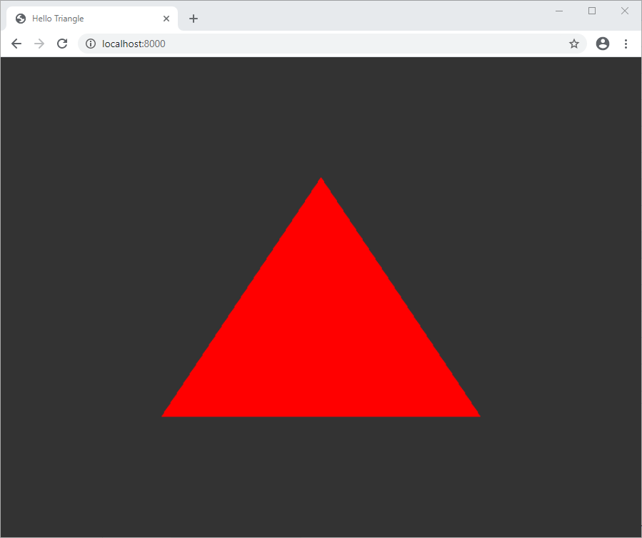

# HelloWebGPU

This a bare minimum test that shows how to draw a red triangle in a web browser using WebGPU and WebAssembly (Emscripten)



Tested with Chrome Canary 86.0 and Microsoft Edge Canary 85.0 with `chrome://flags/#enable-unsafe-webgpu` enabled, and with Firefox Nightly 80.0a1 with `dom.webgpu.enabled` and `gfx.webrender.all` enabled,

## Requirements

* [Emscripten SDK](https://github.com/emscripten-core/emsdk).
* Optional: python 3 to serve the sample.
* Optional: [Shaderc](https://github.com/google/shaderc) to compile the shaders.

The sample is built under linux/WSL, however it should work in Windows or Mac as well by translating the build script to each platform.

## Build

`build.sh [-d] [--emsdk PATH_TO_EMSDK]`

* `-d` to compile in debug mode
* `--emsdk` to specify the Emscripten SDK path

By default, the build script tries to find the Emscripten SDK at _$HOME/mono/sdks/builds/toolchains/emsdk_. This is because this work is originally meant to serve as an external test of _MONO_ + _WebGPU_ + _Emscripten_ integration.

To compile the shaders:

`glslc -Os -mfmt=num -o - -c in.vert`
`glslc -Os -mfmt=num -o - -c in.frag`

## Run

```bash
cd www
python server.py
```

## Related work

The sample is partially based on [WebGPU samples](https://github.com/austinEng/webgpu-samples) and [hello-webgpu](https://github.com/cwoffenden/hello-webgpu)
